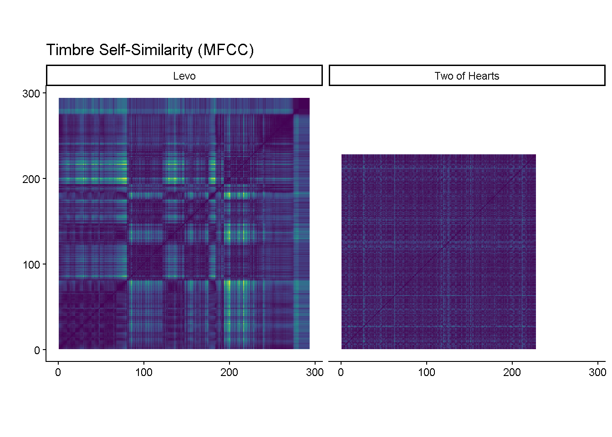
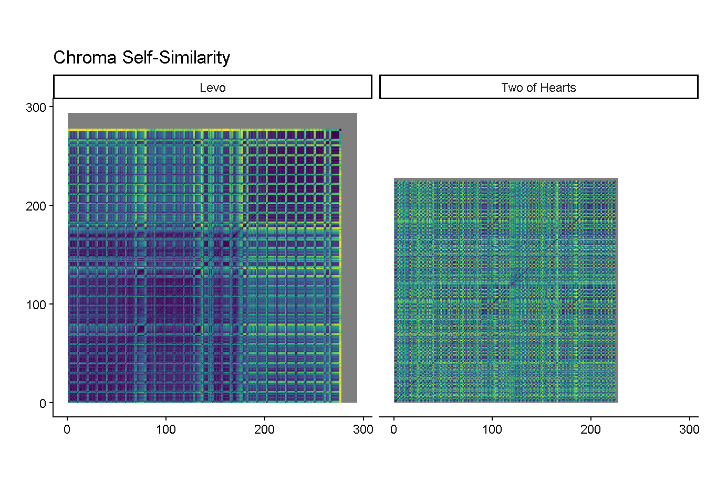

This project compares Two of Hearts and Levo using:

Timbre Self-Similarity (MFCC)

Chroma Self-Similarity

The results show that:
Levo is structured around gradual timbral shifts across sections, whereas Two of Hearts is structured through recurring harmonic cycles. Even though both songs are highly danceable and share a similar tempo, the self-similarity matrices suggest different structural patterns.

https://gijsdehuu.github.io/Homework-week-9/
